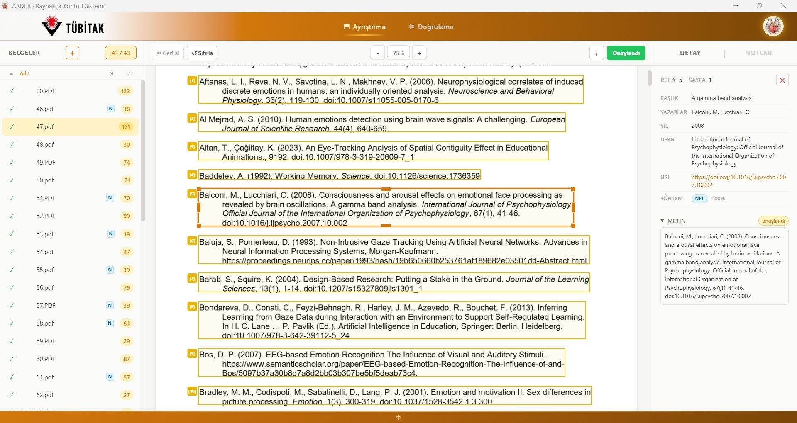
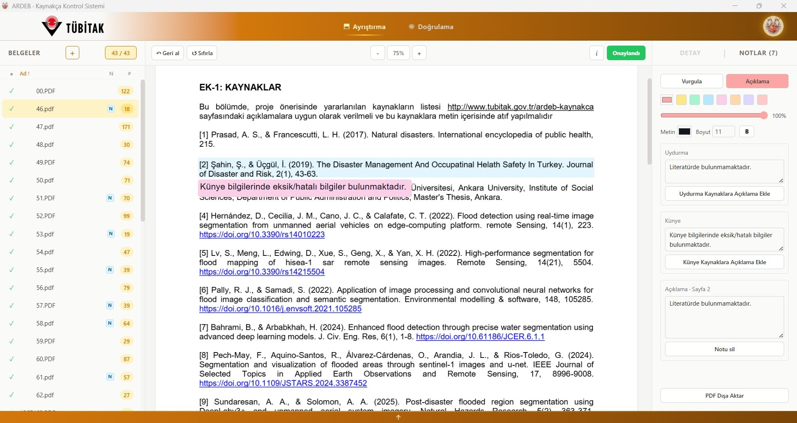
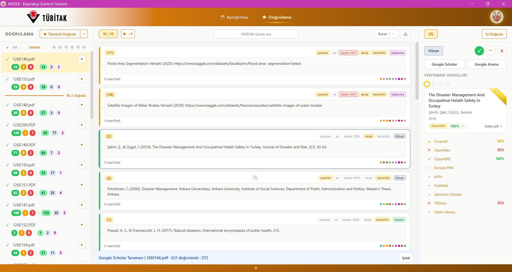
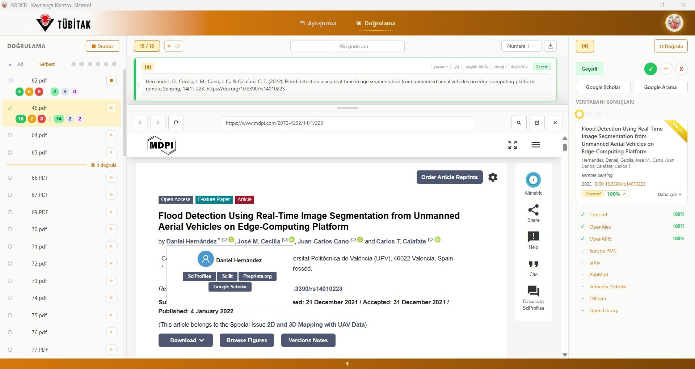
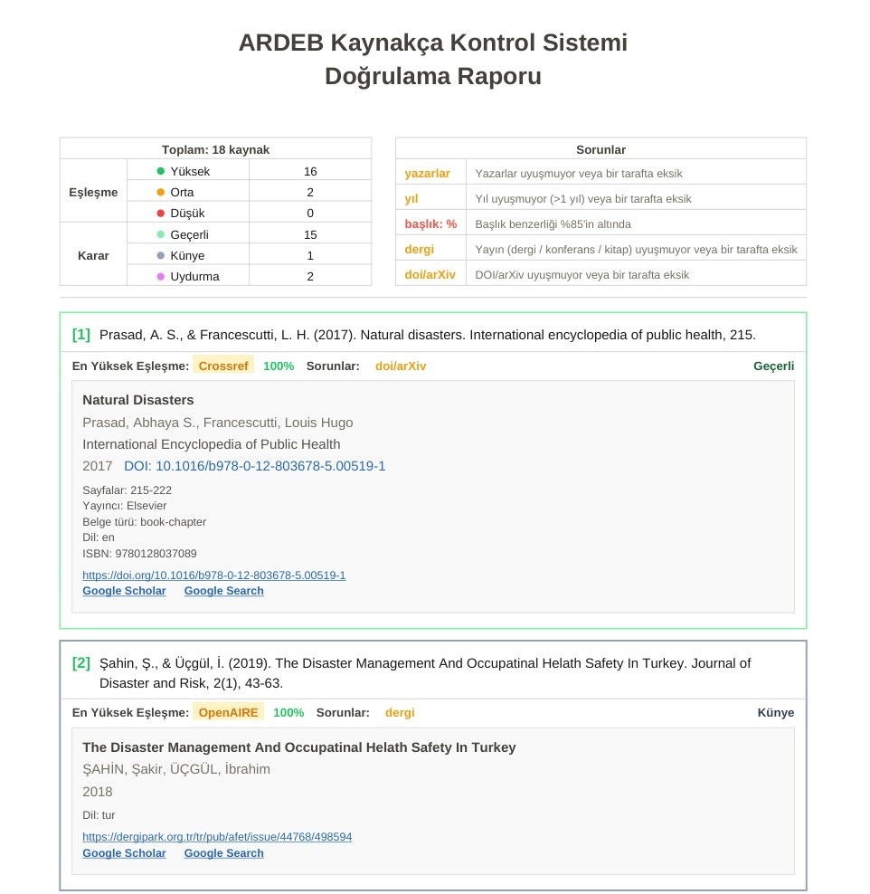

# Atf-ı Memnu


A Windows desktop app for parsing academic PDFs, extracting their source lists, and verifying each source against a panel of scholarly databases — with a dedicated review UI for annotating, correcting, and approving the extracted sources before verification, plus an exportable annotated PDF and a from-scratch verification report.

## What it does

1. **Ingest** — point it at a directory or drop in a batch of PDFs. Each file is parsed in the renderer via `pdfjs-dist`; the source section is located and individual sources are split into editable bounding-box rectangles.
2. **Review** — the parsing page shows each PDF in the middle with its detected source rectangles overlaid. You can draw new ones, edit the text, merge/split, and re-order.
3. **Extract fields (NER)** — for each source, a bundled fine-tuned ONNX citation-parser model (RoBERTa-based, via `onnxruntime` + `tokenizers`) extracts title, authors, year, journal, DOI, ISBN, ISSN, volume, issue, pages, publisher, location and online-availability link into structured fields.
4. **Verify** — the verification page pushes each approved source through the enabled database verifiers in parallel and shows per-database status as it streams in over WebSocket. Sources that don't match can be re-checked via the built-in Google Scholar scanner (a hidden Electron `<webview>` that scrapes results with CAPTCHA handoff).
5. **Annotate & report** — add highlight and callout notes anywhere on the PDF, auto-generate callouts for fabricated / problematic citations from the verification result, and export either an **annotated copy of the original PDF** or a **from-scratch verification report PDF** that lists every source with its decision tag and the best matching record.

The whole UI is fully localized in **English** and **Turkish**, switchable from the Settings page.

## Screens

### Parsing


### Notes & annotations


### Verification


### Webview


### Verification report (PDF export)


## Supported verifiers

**Tier 1 — parallel API search (11 databases):**

- [Crossref](https://www.crossref.org/) · [OpenAlex](https://openalex.org/) · [OpenAIRE](https://explore.openaire.eu/) · [Europe PMC](https://europepmc.org/)
- [arXiv](https://arxiv.org/) · [PubMed](https://pubmed.ncbi.nlm.nih.gov/) · [TR Dizin](https://trdizin.gov.tr/)
- [Open Library](https://openlibrary.org/) · [Semantic Scholar](https://www.semanticscholar.org/) · [BASE](https://www.base-search.net/) (Bielefeld Academic Search Engine — strong on non-English / open-access repository sources)
- [Web of Science](https://www.webofscience.com/) (Clarivate WoS Starter API — opt-in, requires a free Starter or institutional Expanded API key from [developer.clarivate.com](https://developer.clarivate.com/))

**Tier 2 — Google Scholar scan (user-triggered):** sources that Tier 1 can't confirm can be re-checked through a hidden Electron `<webview>` against `scholar.google.com`. Real browser session (cookies + CAPTCHA handoff via overlay), tuned rate limit (4 s + jitter, slowing to 8–15 s after a CAPTCHA), top result optionally enriched with the APA citation string before being scored against the source.

All Tier 1 verifiers share a single pooled `aiohttp` session and run behind a per-host token-bucket rate limiter tuned for each provider's published caps (e.g. arXiv 1 req / 3 s, OpenAlex polite-pool, Crossref 1 req/s). 429 responses temporarily "park" the host with a dynamic retry window, and the orchestrator does a final retry pass for parked hosts before returning. Each verifier returns up to its top 5 candidates plus a search URL; the orchestrator merges them, picks the best, and resolves the source's lifecycle from `pending` → `in_progress` → one of the three `high` / `medium` / `low` status bands.

The Settings page accepts API credentials for **OpenAlex**, **Semantic Scholar**, **PubMed**, **BASE** (IP-allowlist contact identifier), **Web of Science** (Clarivate Starter / Expanded API key), and an **OpenAIRE** refresh token. OpenAIRE tokens expire 30 days after issue; the UI shows a warning starting 7 days before expiry. A polite-pool email (used by Crossref / arXiv / OpenAlex for attribution) can also be set there.

## Scoring & Decisions

> Full algorithm with weights, thresholds, and code references: [`SCORING.md`](SCORING.md).

Match scoring is a composite of title (token_sort + ratio fuzzy), author surname matching, and journal canonicalization, with year / venue / DOI-or-arXiv contributing up to three `+0.10` bonuses. The composite drops into one of three **status bands** that drive the card colour:

| Composite | Status | Colour |
|---|---|---|
| ≥ 0.75 | `high` | green |
| 0.50 – 0.75 | `medium` | orange |
| < 0.50 | `low` | red |

Independently, each source receives a **decision tag** describing field-level consistency:

- `valid` — title + authors + year + venue all match
- `citation` — title matches, OR authors plus one of {year, venue, doi} match
- `fabricated` — neither

…plus up to five problem chips (`!authors`, `!year`, `!journal`, `!doi/arXiv`, `!title`) flagging individual mismatches. Status and decision are independent dimensions — a high-scoring card can still be `citation`, a low-scoring one can be `valid` if the available fields agree.

Verification results are persisted per-PDF on disk so re-opening a PDF restores its prior decisions, status bands, chips, and per-source override state without rerunning anything.

## Architecture

```
┌──────────────────────────────────────────────────────────────┐
│ Electron main process (Node)                                 │
│  ├─ Spawns the Python backend as a subprocess               │
│  ├─ Handles file dialogs, PDF read/write, auto-update       │
│  └─ Secure IPC via preload + contextBridge                  │
└──────────────┬───────────────────────────────────────────────┘
               │
┌──────────────▼───────────────┐      ┌────────────────────────┐
│ Renderer (React + TS + Vite) │◄────►│ Python backend         │
│  ├─ pdfjs-dist pipeline      │ HTTP │  (FastAPI + uvicorn)   │
│  │   (parse, render, detect, │  WS  │  ├─ NER field extract  │
│  │   extract, annotate,      │      │  │   (ONNX Runtime CPU)│
│  │   report)                 │      │  ├─ Verifier panel     │
│  ├─ Zustand stores           │      │  │   (10 DBs + Scholar,│
│  ├─ Parsing / Verification / │      │  │   pooled HTTP,      │
│  │   Settings pages          │      │  │   rate limit)       │
│  ├─ i18n (en / tr)           │      │  ├─ Match scorer       │
│  ├─ Notes layer              │      │  ├─ Author matcher     │
│  └─ Scholar scanner webview  │      │  ├─ URL liveness check │
│                              │      │  ├─ Result cache       │
│                              │      │  └─ OpenAIRE token mgr │
└──────────────────────────────┘      └────────────────────────┘
```

Key design notes:

- **PDF handling lives in the renderer.** Opening, rendering, source detection, bbox text extraction, annotation writing, and report PDF generation all run in the renderer via `pdfjs-dist` and `pdf-lib` — the Python side never touches PDF bytes. There's an in-memory LRU cache of parsed `PDFDocumentProxy` instances so flipping between recently-viewed PDFs skips disk I/O and document parse.
- **NER is the only reason Python is in the loop.** A fine-tuned RoBERTa-based citation-parser model is bundled as a quantized INT8 ONNX file (~125 MB, tracked via git LFS). At runtime we use `onnxruntime` (CPU provider) and a tiny `tokenizers`-based pipeline — no `transformers`, no `optimum`, no `torch`, no GPU runtime, so the packaged bundle stays lean. The model itself is also published on HuggingFace at [temasictfic/citation-ner-int8](https://huggingface.co/temasictfic/citation-ner-int8); the full training + INT8 quantization pipeline (with reproduction guide) lives under [`backend/training/`](backend/training/).
- **Streaming verification.** The orchestrator schedules per-source × per-DB tasks with two concurrency knobs (`max_concurrent_apis`, `max_concurrent_sources_per_pdf`) and pushes individual hits back over a WebSocket channel as soon as they resolve. Cancellation is supported per source.
- **Auto-update.** The shipped app uses `electron-updater` against GitHub Releases — the renderer shows an `UpdateNotification` banner when a new version is downloaded.
- **PyInstaller + electron-builder.** The backend is frozen to a standalone exe via PyInstaller (spec excludes torch / tf / jax, disables UPX for `onnxruntime` DLL safety, and hard-fails the build if the LFS NER model is just a pointer file). The Electron app bundles that exe as `extraResources`.
- **Single-language Chromium bundle.** Only `en-US` and `tr` Chromium locale paks are shipped, matching the in-app i18n locales.

## Prerequisites

- **Node.js** ≥ 24
- **Python** ≥ 3.12 (managed by `uv`)
- **uv** — fast Python package manager (`pipx install uv` or see [uv docs](https://docs.astral.sh/uv/))
- **Git LFS** — required to pull the bundled NER model. After cloning, run `git lfs pull`.
- **Windows 10/11** — the release pipeline targets Windows. Linux/macOS development may work but is untested for packaging.

## Getting started

```bash
# 1. Clone + pull LFS assets
git clone <repo-url>
cd atfimemnu
git lfs pull    # pulls the ~125 MB NER model

# 2. Install Node + Python deps
npm install
cd backend && uv sync && cd ..

# 3. Run in dev mode (Electron spawns the Python backend automatically)
npm run dev
```

## Building a release

Build order matters: the backend must be frozen before electron-builder packages it. The `dist:win` script does the full chain.

```bash
npm run build:backend   # PyInstaller → backend/dist/atfi-memnu-backend/
npm run build           # electron-vite: main + preload + renderer
npm run dist:win        # electron-builder: NSIS installer + portable exe (runs both of the above first)
```

Output lands in `dist/` — an `Atf-I Memnu Setup X.Y.Z.exe` installer and a portable `Atf-I Memnu X.Y.Z.exe`.

### Cutting a tagged release

```bash
npm run release:tag    # bumps version, commits, tags, pushes
```

The push triggers `.github/workflows/release.yml` which runs on `windows-latest`, pulls LFS, syncs the frozen backend env (`uv sync --frozen`), builds, and publishes the installer to GitHub Releases. A separate `pages.yml` workflow publishes the landing page.
